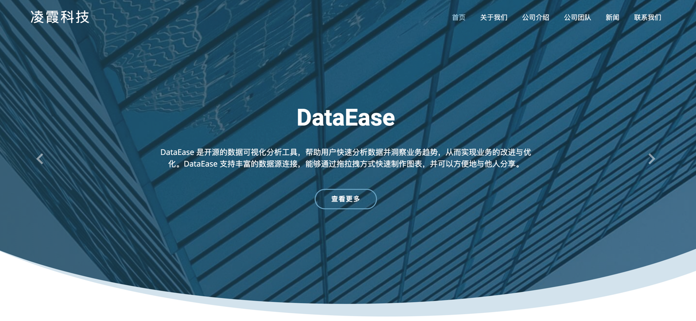
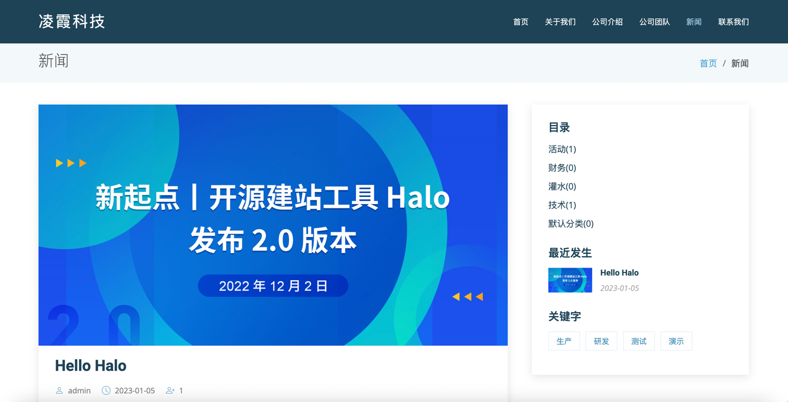

# ModerNa 主题使用与限制

基于Halo2.0开发，将当前目录压缩为zip包后安装

基于 [Moderna](https://bootstrapmade.com/free-bootstrap-template-corporate-moderna/) 模版进行开发

感谢 [bootstrapmade](https://bootstrapmade.com) 提供免费好用的HTML模版

设置步骤

- [x] 设置自定义页面(配置关于/服务/团队/联系我们/博客的自定义页面，菜单中显示的名称对应自定义页面的标题，访问路径对应/别名)
- [x] 在主题中对应的菜单下选择固定模版对应的自定义页面才会对下面的设置有效
- [x] 修改对应需要显示的块数据与编辑需要展示的数据
- [x] 如果需要展示博客内容 需要在文章中添加文章/标签/分类，然后在主题中设置需要展示的内容/分页数量等
- [x] 查看内容。本主题默认自带了模拟数据

预览效果

预览地址:
http://43.139.145.27/

如有版权问题请联系 liuchang.cloud@gmail.com进行修改

主题开发参考 [Halo官方文档](https://docs.halo.run)
